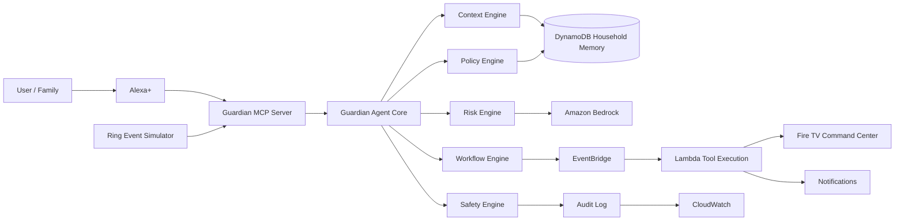

# Guardian AI Architecture



## Local Prototype

The local implementation runs in one Python process:

- `server/app.py` serves the API and web UI.
- `web/` contains the Fire TV-style command center.
- State is in memory for fast, repeatable judging demos.
- Every important action is logged into an auditable timeline.
- The decision engine emits structured JSON so judges can see reasoning, context, policy, risk, and blocked actions.

## Agent Core

Guardian follows this decision path:

```text
Event
  -> Context snapshot
  -> Household policy lookup
  -> Risk classification
  -> Recommended action
  -> Block unsafe actions
  -> Explain decision
  -> Update Fire TV / Alexa+ surface
```

## MCP Layer

The current prototype exposes a tool catalog at `/api/mcp/tools`. In the competition version, these become the Alexa+ MCP server tools:

- `get_home_status()`
- `get_recent_events()`
- `get_household_context()`
- `start_wellness_check(person_id)`
- `notify_household_member(member_id, message)`
- `show_fire_tv_alert(headline, message, actions)`
- `create_incident(kind, risk, title)`
- `resolve_incident(incident_id)`
- `escalate_incident(incident_id)`
- `create_guardian_rule(source_text)`

## AWS Production Mapping

| Local Prototype | AWS Production |
| --- | --- |
| In-memory state | DynamoDB |
| Simulated Ring button | Ring event webhook / simulator |
| Python HTTP server | AgentCore Runtime container |
| Deterministic risk engine | Bedrock-assisted risk and explanation |
| Timeline list | CloudWatch structured logs |
| Browser Fire TV view | Fire TV web app / app surface |
| `/mcp` | Streamable HTTP MCP server |
| `/webhooks/ring` | Ring HTTPS webhook receiver |

## Streamable HTTP MCP

Guardian exposes a single MCP endpoint:

```text
/mcp
```

It supports:

- `POST /mcp` for JSON-RPC MCP requests.
- `GET /mcp` for a lightweight server-sent event readiness stream for 2025-11-25-style Streamable HTTP clients.

Implemented JSON-RPC methods:

- `initialize`
- `notifications/initialized`
- `tools/list`
- `tools/call`

The production AgentCore deployment should run the container on `0.0.0.0:8000` with `/mcp` as the protocol path.

## Ring Webhook Shape

Guardian includes a production-style webhook receiver:

```text
/webhooks/ring
```

It:

- accepts HTTPS POST event payloads,
- verifies `X-Signature` with HMAC-SHA256 when `RING_WEBHOOK_SECRET` is configured,
- maps person/package events into Guardian events,
- acknowledges quickly with `202 Accepted`,
- hands the event to the Guardian decision engine.

## Winning Technical Claim

Guardian uses AI for contextual judgment, but policy enforcement is structured and auditable. The system can explain why it acted, why it asked for approval, and why it refused unsafe actions.
